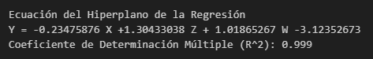

# Regresión Lineal
Es un método utilizado para modelar la relación entre una o más variables independientes (predictoras) y una variable dependiente (respuesta) continua. La relación entre las variables se modela como una función lineal.

# [Regresión Lineal Simple](https://github.com/jrguignan/Regresion_Lineal_simple_y_multiple/blob/main/regresion_lineal_simple.ipynb)

Un análisis de la relación entre x y Y requiere el planteamiento de un modelo estadístico. Con frecuencia un estadístico utiliza un modelo como representación de un 
ideal que, en esencia, define cómo percibimos que el sistema en cuestión generó los 
datos. Para este caso el modelo es el de una recta, de las cual nos toca conseguir los valores de $\beta_{0}$ y $\beta_{1}$, los cuales serían el contre con en eje y la pendiente de la recta respectivamente.

### Modelo Estadístico:

$$ Y = \beta_{0} + \beta_{1}x \newline

\beta_{0} = (n sum_{1}^{n}xy) - sum_{1}^{n}x sum_{1}^{n}y  $$

$$ \beta_{1} = $$

## Desde Cero - from scratch

## Usando Scikit-Learn

# [Regresión Lineal Múltiple](https://github.com/jrguignan/Regresion_Lineal_simple_y_multiple/blob/main/regresion_lineal_multiple.ipynb)

## Desde Cero - from scratch

## Usando Scikit-Learn

*nota:* Existen más tipos de regresiones lienales, como la ponderada, ridge, lasso, mínimos cuadrados parciales, elasticnet y la logística.
 

# Conclusión

Se produjo lo que se esperaba, dieron los mismos valores tanto para los cálculos con ecuacines análiticas como con el uso de la librería sckikit-learn, para 8 decimales dio exactamente igual.

<h2> Es importante tener en cuenta que para hacer regresión de manera rigurosa, hay que hacer una validación de los datos. <h2>

# Validación de los Datos

**Limpieza de Datos:** Elimina los valores atípicos, los datos faltantes y las observaciones duplicadas. La presencia de datos erróneos puede afectar negativamente la calidad del modelo.

**Normalidad:** Verifica la distribución de las variables para asegurarte de que se ajusten a una distribución normal. La regresión lineal múltiple asume que las variables independientes y dependiente siguen una distribución normal.

**Linealidad:** Asegúrate de que exista una relación lineal entre las variables independientes y la variable dependiente. Puedes usar gráficos de dispersión para visualizar esta relación.

**Multicolinealidad:** Comprueba si existe multicolinealidad entre las variables independientes. La multicolinealidad puede afectar la precisión de los coeficientes de regresión. Puedes utilizar técnicas como el factor de inflación de la varianza (VIF) para identificar la multicolinealidad.

**Homocedasticidad:** Verifica si la varianza de los residuos es constante en todos los niveles de las variables independientes. Los gráficos de residuos pueden ayudarte a identificar la homocedasticidad.

**Independencia de los Residuos:** Asegúrate de que los residuos de la regresión no muestren patrones sistemáticos, como autocorrelación. Los gráficos de autocorrelación de residuos pueden ser útiles para detectar este problema.

**Validación Cruzada:** Divide tus datos en conjuntos de entrenamiento y prueba para evaluar el rendimiento del modelo en datos no vistos. La validación cruzada ayuda a evitar el sobreajuste y proporciona una estimación más realista del rendimiento del modelo.

# Autor
- José R. Guignan
- Mail: joserguignan@gmail.com
- Linkedin: [https://www.linkedin.com/in/jrguignan](https://www.linkedin.com/in/jrguignan)